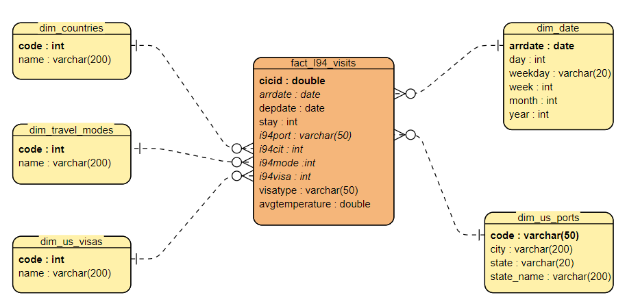

### Data Engineering Capstone Project

#### Project Summary

The idea of this project is to build ETL pipeline that aquires the I94 immigration data and city temperature to answer questions regarding average temperature and tourist arrivals to certian cities.

The project follows the follow steps:

- Step 1: Scope the Project and Gather Data
- Step 2: Explore and Assess the Data
- Step 3: Define the Data Model
- Step 4: Run ETL to Model the Data
- Step 5: Complete Project Write Up

### Step 1: Scope the Project and Gather Data

#### Scope 
In this project, I will create ETL pipeline that aquires and aggregates the I94 immigration data and average temperature date by destination city for April, 2016. I will use provided data sources to build stage tables. Next step will be to create fact table and necessary dimension tables. To create this solution, I will use Pandas, PySpark and AWS S3 buckets.

#### Describe and Gather Data 

* **I94 immigration data** - comes from the US National Tourism and Trade Office ([NTTO](https://www.trade.gov/national-travel-and-tourism-office)), provided by Udacity. The data is provided in [sas7bdat  binary file format](https://cran.r-project.org/web/packages/sas7bdat/vignettes/sas7bdat.pdf). I will use the following attributes:
    - i94cit - code of visitor origin country
    - i94port - code of destination city in the US
    - i94mode - code of transportation mode
    - arrdate - arrival date to the US
    - depdate - departure date from the US
    - i94visa - code of visa type 
    - visatype - class of admission legally admitting the non-immigrant to temporarily stay in US
    
    
* **City temperature data** - dataset comes from [Kaggle](https://www.kaggle.com/sudalairajkumar/daily-temperature-of-major-cities). The dataset is in [csv](https://docs.fileformat.com/spreadsheet/csv/) format. I will use the following attributes:
    - date
    - city
    - state
    - average temperature

### Step 2: Explore and Assess the Data
#### Explore the Data 

Data quality issues:

* **I94 immigration data**
    - invalid ports, some port codes are missing or does not belong to ports in the US
    - missing values for departure date - cca 4.6% of records have no values
    - missing values for arrival mode - cca 0.0077% of records have no values
    - missing values for match of arrival and departure records - cca 4.47 of records have no values
    
    
* **City temperature data**
    - worldwide data - only records for US ports for April 2016 are necessary
    - convert the columns City and State to uppercase to speed up joining with city mapping list where the names are in upper case
        
#### Cleaning Steps

* **I94 immigration data**
    - remove records with invalid ports
    - remove records without departure date
    - remove records without arrival mode
    - remove records without match of arrival and departure records
    
    
* **City temperature data**
    - filter the records to get data for US ports for April 2016
    - change column case for columns City and State

### Step 3: Define the Data Model
#### 3.1 Conceptual Data Model

As a concept, I will use the following star schema:

* **Fact table**
    - fact_i94_visits - contains data from I94 immigration data joined with daily average temperature by the US port city and arrival data
    
    
* **Dimension tables**
    - dim_countries - contains list of countries, it gives an information about which country does visitor comes from
    - dim_travel_modes - contains list of travel modes, it gives an information about transformation mode used by visitor to come to the US
    - dim_us_visas - contains list of visas, it gives an information about the reason of visiting US
    - dim_date - contains date information
    - dim_us_ports - contains list of US ports, it gives an information about which city or state do visitors visit

#### 3.2 Mapping Out Data Pipelines

The ETL pipeline steps are described bellow:

<ol>
    <li>Load raw data to the Spark dataframes: <em>df_spark_i94</em> and <em>df_spark_temperature</em></li>
    <li>Clean each Spark dataframe and write each cleaned dataframe into parquet as staging tables: <em>stage_i94_immigration</em> and <em>stage_city_temperatures</em></li>
    <li>Create and write dimension tables into parquet: <em>dim_countries</em>, <em>dim_travel_modes</em>, <em>dim_us_visas</em> and <em>dim_us_ports</em></li>
    <li>Create and write fact table <em>fact_i94_visits</em> by joining staging tables <em>stage_i94_immigration</em> and <em>stage_city_temperatures</em></li>
    <li>Run quality checks</li>
</ol>   

### Step 4: Run Pipelines to Model the Data 
#### 4.1 Create the data model
Build the data pipelines to create the data model.

Prepare dimension tables

#### 4.2 Data Quality Checks

To ensure the pipeline ran as expected, I need to perform a number of quality checks. I have prepared the following:
 * Integrity constraints on the relational database to check if:
     * certain column exists on certain table
     * certain column with certain data type exists on certain table
     * logical primary key is really primary key (unique key check) 
 * Unit tests for the scripts to ensure they are doing the right thing
     * check if there is any arrivals outside expected period (non-April 2016)
 * Source/Count checks to ensure completeness
     * check if there are rows in certain tables
 
Run Quality Checks

#### 4.3 Data dictionary 
Create a data dictionary for your data model. For each field, provide a brief description of what the data is and where it came from. You can include the data dictionary in the notebook or in a separate file.

Fact table

***fact_i94_visits*** - extracted from I94 immigration data for April, 2016; combined with city temperature data provided by Kaggle.
 * cicid - double - primary key
 * arrdate - date - date of arrival
 * depdate - date - date of departure
 * stay - int - number of days that visitor has stayed in the US
 * i94port - varchar - three-character code of destination port/city
 * i94cit - int - three-digit code of visitor's origin country
 * i94mode - int - one-digit code of transportation mode
 * i94visa - int - one-digit code of visa type
 * visatype - varchar - class of admission legally admitting the non-immigrant to temporarily stay in US
 
Dimension tables

***dim_countries*** - extracted from mapping text, which is provided by Udacity
 * code - int - primary key, three-digit code of visitor's origin country
 * name - varchar - name of the origin country
 
***dim_travel_modes*** - extracted from mapping text, which is provided by Udacity
 * code - int - primary key, one-digit code of transportation mode
 * name - varchar - name of the transportation mode
 
***dim_us_visas*** - extracted from mapping text, which is provided by Udacity
 * code - int - primary key, one-digit code of visa type
 * name - varchar - name of the visa type
 
***dim_us_date*** - extracted from fact table 
 * arrdate - date - primary key, date of arrival
 * day - int - day of arrival
 * weekday - varchar - weekday of arrival
 * week - int - week of arrival
 * month - int - month of arrival
 * year - int - year of arrival
 
***dim_us_ports*** - extracted from mapping text, which is provided by Udacity
 * code - varchar - primary key, three-character code of destination port/city
 * city - varchar - city of the arrival
 * state - varchar - state code of the arrival
 * state_name - varchar - name of the state of the arrival

#### Step 5: Complete Project Write Up
* Clearly state the rationale for the choice of tools and technologies for the project.
    - In this project, to build the data model, ETL pipeline and data lake, I have used pandas library, Apache Spark and Amazon S3. I have used pandas for dealing with small datasets like reading text files with mapping data. For processing of large dataset like I94 immigration data (over three million records per month), I have used Apache Spark, because it handles large amounts of data coming from multiple different datasources and data formats with ease. And finally, to implement a data lake, I have used Amazon S3 to store fact and dimension tables in parquet format.
* Propose how often the data should be updated and why.
    - It depends how often the data is being provided by the transactional system or how often do the end users need the fresh data. My proposal will be to update data on monthly or weekly basis.
* Write a description of how you would approach the problem differently under the following scenarios:
 * The data was increased by 100x.
    - In that case, a Spark cluster setup on AWS EMR with be a solution.
 * The data populates a dashboard that must be updated on a daily basis by 7am every day.
    - For this purpose, I would introduce a scheduler tool to manage certain tasks. Apache Airflow, with his DAGs, would be a very good solution. 
 * The database needed to be accessed by 100+ people.
    - If the problem occurs, I would investigate how to optimize Spark cluster utilization by the resource manager. Resource managers decide how to allocate cluster resources among many users and applications. I would propose Spark integration with one of the resource managers like Apache Yarn or Mesos.
     

